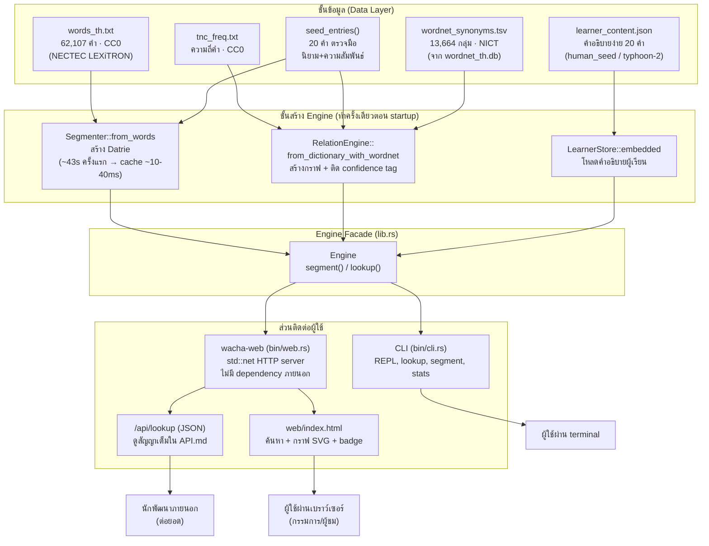

# วาจา (WACHA) — คัมภีร์รวบยอดของโปรเจกต์

**เอกสารอ้างอิงฉบับสมบูรณ์ สำหรับการแข่งขัน "เปิดคลังคำ พลิกคลังคิด" (Dictionary Reimagined Hackathon)**
จัดโดย สำนักงานราชบัณฑิตยสภา (Office of the Royal Society of Thailand, ORST)

เอกสารนี้รวบรวมทุกอย่างที่จำเป็นเกี่ยวกับโปรเจกต์นี้ไว้ในที่เดียว — ที่มาของปัญหา หลักฐานอ้างอิง
สถาปัตยกรรม หลักการทางคณิตศาสตร์ที่ใช้ ผลลัพธ์ที่ตรวจสอบแล้วจริง และการประเมิน impact/novelty อย่าง
ตรงไปตรงมา เอกสารอื่นในโปรเจกต์ (`AGENT_HANDOFF.md`, `PROGRESS.md`, `PITCH.md`, `wacha/API.md`) ยังคงเป็น
แหล่งข้อมูลที่ update ต่อเนื่อง — ไฟล์นี้คือภาพรวมนิ่งๆ ฉบับสมบูรณ์ ณ วันที่เขียน

**วันที่จัดทำ:** 2026-09-12 · **สถานะโปรเจกต์:** ผ่านการตรวจสอบ (verify) แบบรันจริงทุกขั้นตอนแล้ว
ไม่ใช่แค่คำกล่าวอ้าง (ดูหมวด 8 "ผลลัพธ์ที่ตรวจสอบแล้ว")

---

## สารบัญ

1. [ภาพรวม (Overview)](#1-ภาพรวม-overview)
2. [ที่มาของปัญหา และเพนพอยต์](#2-ที่มาของปัญหา-และเพนพอยต์)
3. [หลักฐาน/งานวิจัยอ้างอิง](#3-หลักฐานงานวิจัยอ้างอิง)
4. [แนวคิดโซลูชัน — ทำไมต้องเลือกทางนี้](#4-แนวคิดโซลูชัน--ทำไมต้องเลือกทางนี้)
5. [สถาปัตยกรรมระบบ (พร้อมแผนภาพ Mermaid)](#5-สถาปัตยกรรมระบบ-พร้อมแผนภาพ-mermaid)
6. [หลักการทางคณิตศาสตร์/อัลกอริทึมที่ใช้ — อธิบายละเอียด](#6-หลักการทางคณิตศาสตร์อัลกอริทึมที่ใช้--อธิบายละเอียด)
7. [ข้อมูล (Data) และสัญญาอนุญาต](#7-ข้อมูล-data-และสัญญาอนุญาต)
8. [ผลลัพธ์ที่ตรวจสอบแล้ว (Verified Results)](#8-ผลลัพธ์ที่ตรวจสอบแล้ว-verified-results)
9. [Impact — ประเมินตรงไปตรงมา](#9-impact--ประเมินตรงไปตรงมา)
10. [Novelty — ประเมินตรงไปตรงมา](#10-novelty--ประเมินตรงไปตรงมา)
11. [แผนที่ไฟล์ทั้งโปรเจกต์](#11-แผนที่ไฟล์ทั้งโปรเจกต์)
12. [สรุปหนึ่งย่อหน้า — งานเราคืออะไร](#12-สรุปหนึ่งย่อหน้า--งานเราคืออะไร)

---

## 1. ภาพรวม (Overview)

**วาจา (WACHA)** เป็นต้นแบบพจนานุกรมไทยยุคใหม่ ที่ตั้งใจตอบโจทย์การแข่งขัน "เปิดคลังคำ พลิกคลังคิด"
ของสำนักงานราชบัณฑิตยสภา ด้วยแนวทางที่ต่างจากสิ่งที่ทีมอื่นน่าจะทำ (ครอบ LLM รอบข้อความพจนานุกรม):

> **วาจาเป็นเครื่องมืออ่านและอธิบายพจนานุกรมแบบ "modelless" — ไม่มีโมเดล AI ใดๆ รันตอนใช้งานจริง
> (deterministic, explainable) ยกเว้นจุดเดียวที่ตั้งใจแยกไว้ชัดเจน (คำอธิบายง่ายสำหรับผู้เรียน ซึ่งทำ
> ล่วงหน้าแบบออฟไลน์ ไม่ใช่ runtime dependency)**

**ชื่อ "วาจา":** เป็นคำไทยแท้ที่แปลว่า "คำพูด/ถ้อยคำ" (เช่น สัตย์วาจา = คำพูดที่ซื่อสัตย์) — เลือกใช้แทน
ชื่อภาษาอังกฤษล้วน เพื่อให้สื่อความหมายตรงกับโดเมน (ภาษาไทย/พจนานุกรม) พร้อม backronym ภาษาอังกฤษที่
แม็ปกับโค้ดจริงทุกตัวอักษร ไม่ใช่คำโฆษณาลอยๆ:

| ตัวอักษร | แปลว่า | อยู่ตรงไหนในโค้ด |
|---|---|---|
| **W**ord | คำ | `segmenter.rs` — การตัดคำที่ขับเคลื่อนด้วยรายการคำพจนานุกรมเอง |
| **A**rchitecture | โครงสร้าง | `Datrie` double-array trie (Aoe, 1989) — โครงสร้างข้อมูลแบบลำดับชั้นจริงๆ |
| **C**luster-aware | รู้จักกลุ่มอักขระ | `tcc.rs` — แก้ปัญหา Thai Character Cluster (บั๊กจริงที่พบและแก้แล้ว) |
| **H**ybrid | ผสมผสาน | katgpt-rs (tokenizer) + AXIOM (knowledge graph) มารวมกัน |
| **A**nalysis | การวิเคราะห์ | `relations.rs`/`graph.rs` — Personalized PageRank + BFS ให้เหตุผลได้ |

**รูปแบบการแข่งขัน:** Hackathon 2 วัน 1 คืน, 10 ทีม ทีมละ 2-4 คน

---

## 2. ที่มาของปัญหา และเพนพอยต์

### 2.1 โจทย์จากผู้จัด (ORST) — สรุปต้นฉบับ

> "พจนานุกรมเป็นทรัพยากรทางภาษาที่อยากปรับตัวในยุค AI — เปลี่ยนพจนานุกรมจากคลังคำศัพท์ → สู่คลังข้อมูล
> พจนานุกรม → เป็นมากกว่าพจนานุกรม (เปิดหาความหมาย), สารานุกรม → หาความรู้เฉพาะด้าน ปกติชินกับการหาเป็น
> เล่ม แต่ปัจจุบันก็มีผ่านเว็บ แต่ก็แค่นั้น อยากให้มันเป็นมากกว่านั้นเพราะตอนนี้มี AI เข้ามา"
>
> **วัตถุประสงค์:** เห็นภาพการระดมไอเดีย ยกระดับการสืบค้นให้ตอบโจทย์ยุคดิจิทัล, สร้าง prototype ระบบ
> หน้าตา function ช่วยเรียนรู้ภาษาไทยใช้ยังไง, สร้างเครือข่าย, ส่งเสริม AI/Open Data

### 2.2 เพนพอยต์ที่ระบุได้ — แต่ละอันมีหลักฐานรองรับ (ดูหมวด 3)

| เพนพอยต์ | หลักฐาน |
|---|---|
| ราชบัณฑิตยสภาไม่มีช่องทางเปิดให้ดึงข้อมูลพจนานุกรมแบบ bulk/API | นักพัฒนาอิสระต้อง crawl เว็บไซต์ทางการเองเพื่อสร้างชุดข้อมูล ([chameleonTK/thai-dictionary](https://github.com/chameleonTK/thai-dictionary), 2021) แทนที่จะมีช่องทางที่ทางการรองรับ |
| ภาษาไทยเป็นภาษาที่มีทรัพยากร NLP/ข้อมูลน้อยกว่าภาษาอื่น | งานสำรวจวิชาการยืนยันตรงกัน 2 ฉบับ (LREC 2022, PyThaiNLP/NLP-OSS 2023) — ก่อนปี 2016 ไม่มีเครื่องมือ NLP ไทยแบบ open-source มาตรฐานเดียวกันเลย |
| ทรัพยากรศัพท์ไทยที่มีมักเป็นพจนานุกรมสองภาษา ไม่ใช่ฐานข้อมูลศัพท์ไทยแท้ที่ครบถ้วน | LREC 2022 survey (ระดับความเชื่อมั่นปานกลาง) |
| การพัฒนา Thai LLM ล่าช้ากว่าภาษาอื่นเพราะข้อมูล/benchmark ไม่พอ | arXiv:2410.04795 (Thai LLM survey) |
| ยังไม่มีฟีเจอร์ "ช่วยเรียนรู้การใช้ภาษาไทย" ที่จับต้องได้ในพจนานุกรมออนไลน์ปัจจุบัน | จากการสำรวจโจทย์และพจนานุกรมออนไลน์ที่มีอยู่ — เป็นเพียงการค้นหาความหมายแบบเดิม |
| กลุ่มผู้ใช้ที่มีหลักฐานได้รับผลกระทบชัดเจนที่สุด: นักพัฒนา/นักวิจัย NLP ไทย | สะท้อนจากกรณี crawl ข้างต้น + ชุดข้อมูลไทยที่มีอยู่มักติด license จำกัด |

**หมายเหตุความซื่อสัตย์:** กลุ่มผู้ใช้อื่น (ผู้เรียนภาษา, นักเรียน, นักแปล) ที่มักถูกอ้างในโจทย์แบบนี้
ทีมไม่พบหลักฐานเชิงตัวเลขที่ยืนยันได้ในรอบการค้นคว้า — นำเสนอตามความเป็นจริงว่าเป็นสมมติฐานที่ยังไม่มี
ข้อมูลรองรับ ไม่ใช่ข้อเท็จจริงที่พิสูจน์แล้ว

---

## 3. หลักฐาน/งานวิจัยอ้างอิง

ทุกรายการผ่านกระบวนการ deep-research แบบ 3-vote adversarial verification (ยกเว้นที่ระบุไว้ว่า
unverified) บันทึกเต็มอยู่ที่ `knowledge-base/topics/thai-dictionary-hackathon.md` ในเวิร์กスペース

### 3.1 หลักฐานเรื่องปัญหา/ช่องว่าง (open data, ทรัพยากรภาษา)

| # | แหล่งอ้างอิง | ประเด็นที่ยืนยัน |
|---|---|---|
| 1 | [ORST homepage](https://www.orst.go.th/) + [gdcatalog.go.th ORST dataset](https://gdcatalog.go.th/dataset/gdpublish-orst-0301) | ไม่มี API/bulk data ทั่วไปสำหรับพจนานุกรมฉบับราชบัณฑิตยสภา (มีแค่ CSV ความหมายชื่อบุคคล ขอบเขตแคบ) |
| 2 | [chameleonTK/thai-dictionary (GitHub)](https://github.com/chameleonTK/thai-dictionary) | นักพัฒนาต้อง crawl เว็บไซต์ราชบัณฑิตยสภาเองเพื่อสร้างชุดข้อมูล (2021-08-17) |
| 3 | [LREC 2022 — Thai NLP survey](https://aclanthology.org/2022.lrec-1.697/) | ภาษาไทยขาดทรัพยากร NLP เมื่อเทียบกับจีน/อังกฤษ/เยอรมัน ก่อนปี 2016 ไม่มีเครื่องมือมาตรฐาน |
| 4 | [PyThaiNLP — NLP-OSS 2023](https://aclanthology.org/2023.nlposs-1.4.pdf) | ยืนยันช่องว่างเดียวกันจากผู้สร้างเครื่องมือเอง |
| 5 | [arXiv:2410.04795 — Thai LLM survey](https://arxiv.org/pdf/2410.04795) | Thai LLM พัฒนาช้ากว่าภาษาอื่นเพราะข้อมูล/benchmark ไม่พอ |
| 6 | [LREC 2022 — Wiktextract paper](https://aclanthology.org/2022.lrec-1.140/) | ตัวอย่างภาษาที่มีทรัพยากรเปิดดี (อังกฤษ) เทียบต่างกับไทยชัดเจน |

### 3.2 หลักฐานสำหรับ Q7 (ผลลัพธ์/วิธีวัด) และแนวคิดโครงสร้างข้อมูล

| # | แหล่งอ้างอิง | ประเด็นที่ยืนยัน |
|---|---|---|
| 7 | [Lexonomy — New developments (Sketch Engine, 2021)](https://www.sketchengine.eu/wp-content/uploads/2021-New-developments-in-Lexonomy.pdf) | เกณฑ์เทียบเคียงระยะยาว: 2,700+ ผู้ใช้, 5,400+ พจนานุกรม, 34M+ รายการ (หลายปี ไม่ใช่เป้าหมาย 2 วัน) |
| 8 | [Nielsen Norman Group — Success Rate](https://www.nngroup.com/articles/success-rate-the-simplest-usability-metric/) | ระเบียบวิธีวัดผล usability แบบมาตรฐาน (4-level graduated scale) ที่ทีมใช้เป็นแนวทาง |
| 9 | [Lexonomy (GitHub)](https://github.com/lexicalcomputing/lexonomy), [Etytree](https://meta.wikimedia.org/wiki/Grants:IEG/A_graphical_and_interactive_etymology_dictionary_based_on_Wiktionary/Renewal) | แรงบันดาลใจการทำพจนานุกรมเป็นกราฟ/โครงสร้างข้อมูล ไม่ใช่ข้อความแบน (Etytree ใช้กราฟไม่ใช่ต้นไม้ เพราะความสัมพันธ์จริงมี cycle) |

### 3.3 หลักการทางเทคนิค/คณิตศาสตร์ (รายละเอียดเต็มในหมวด 6)

| # | แหล่งอ้างอิง | ใช้ที่ไหน |
|---|---|---|
| 10 | Aoe, J. (1989). *An Efficient Digital Search Algorithm by Using a Double-Array Structure.* IEEE Transactions on Software Engineering. | `wacha/src/datrie.rs` — โครงสร้างตัดคำ |
| 11 | Page, L., Brin, S., Motwani, R., & Winograd, T. (1998). *The PageRank Citation Ranking: Bringing Order to the Web.* Stanford InfoLab. | รากฐานของอัลกอริทึมจัดอันดับใน `graph.rs` |
| 12 | Haveliwala, T. H. (2002). *Topic-Sensitive PageRank.* WWW 2002. | ต่อยอด PageRank ให้ personalize ตามคำค้น — คือสิ่งที่ `personalized_pagerank()` ทำ |

**หมายเหตุความซื่อสัตย์เรื่องอ้างอิง (แก้ไข 2026-09-13):** คอมเมนต์เดิมใน `graph.rs` อ้างว่าสูตร
hub-correction (`log π_q(e) − log π(e)`) มาจากงานของ **Milne & Witten** — **ซึ่งผิด** ตรวจสอบแล้วว่า
measure ของ Milne & Witten เป็นสูตรวัดความเกี่ยวข้องแบบ NGD (Normalized Google Distance) บนการทับซ้อนของ
ลิงก์ Wikipedia และงาน CIKM'08 ของเขาไม่มีเนื้อหาเรื่อง PageRank เลย ที่มาที่ถูกต้องคือ **FolkRank**
(Hotho et al. 2006; Jäschke et al. 2007) — personalized PageRank ลบด้วย global PageRank จากรอบ iteration
เดียวกัน **ข้อควรระวังที่ต้องพูดตามจริง:** FolkRank ใช้ *ผลต่าง* ธรรมดา (π_q − π) ส่วนสูตรของเราเป็นแบบ
*log-ratio* (`log π_q − log π`) ซึ่งเป็น **variant ของเราเอง ไม่ใช่สูตร FolkRank ที่ตีพิมพ์** — ระบุให้ชัด
ว่าเป็นการดัดแปลง ใช้ Page et al. 1998 และ Haveliwala 2002 เป็นหลักฐานหลักของกลไก PageRank/personalization

### 3.4 ที่มาข้อมูลจริง

| # | แหล่งอ้างอิง | ใช้เป็น |
|---|---|---|
| 13 | PyThaiNLP `words_th.txt`/`tnc_freq.txt` corpus (CC0-1.0) ← NECTEC LEXiTRON | รายการคำ 62,107 คำ + ความถี่ |
| 14 | Thai WordNet `wordnet_th.db` (NICT permissive license) | ความสัมพันธ์คำพ้อง ~29,000 คำ |

---

## 4. แนวคิดโซลูชัน — ทำไมต้องเลือกทางนี้

### 4.1 ทางเลือกที่พิจารณาและปัดตก (พร้อมเหตุผล)

| ทางเลือก | ทำไมไม่เลือก |
|---|---|
| ใช้ `katgpt-transformer` (LLM ของทีมเอง) สร้างข้อความ | ตรวจโค้ดจริงแล้วพบว่ารันได้แค่ **random-init weights** — ไม่มี loader สำหรับ checkpoint จริงเลย ("output is gibberish, not real text" ตามคอมเมนต์ในโค้ดเอง) |
| ใช้ AXIOM ทั้งระบบ (VSA + text-decomposition + QA engine) | AXIOM ประกาศตัวเองใน repo ว่าเป็น **"forensic archive"** (เลิกพัฒนาแล้ว) และเป็นภาษาอังกฤษเท่านั้น (Thai "planned" แต่ไม่เคยทำ) มี decomposition pipeline ที่ noisy ~30% |
| ครอบ LLM API (เช่น ChatGPT) รอบข้อความพจนานุกรมทั้งหมด | คาดว่าเป็นแนวทางที่ทีมอื่นส่วนใหญ่จะเลือก — เดาคำตอบได้ ไม่เหมือนเดิมทุกครั้ง หลอนได้ ต้องมี GPU/เน็ต ไม่ตรงกับความต้องการ "ถูกต้อง+อธิบายได้" ของโจทย์ |
| ต่อ Typhoon 2 แบบ live API ตอนเดโม | เสี่ยงเน็ต/เซิร์ฟเวอร์ล่มหน้างาน จึงเปลี่ยนเป็น **offline precompute** (ดูหมวด 5) |

### 4.2 ทางที่เลือก: Hybrid สองงานวิจัยของทีมเอง

> ใช้ **เฉพาะส่วนที่พิสูจน์แล้วว่าทำงานได้จริง** จากงานวิจัยเดิมของทีม (katgpt-rs, AXIOM) แทนการสร้างใหม่
> จากศูนย์ หรือพึ่งพา LLM ทั้งระบบ — **vendor เข้ามาเป็นโค้ดของโปรเจกต์เอง** ไม่ผูกกับ repo ภายนอกที่ทีม
> ไม่ได้เป็นเจ้าของ (ดูเหตุผลในหมวด 5.2)

---

## 5. สถาปัตยกรรมระบบ (พร้อมแผนภาพ Mermaid)

### 5.1 ภาพรวมการไหลของข้อมูล



### 5.2 ทำไมต้อง "vendor" โค้ดแทนที่จะพึ่งพา repo ภายนอก

`wacha` มีสองไฟล์ที่ **คัดลอกโค้ดต้นทางมาไว้ในโปรเจกต์นี้เอง** แทนที่จะอ้างเป็น dependency:

- `wacha/src/datrie.rs` — คัดลอกมาจาก `katgpt-rs/crates/katgpt-tokenizer` (MIT license) พร้อมแก้ 2 บั๊ก
  (panic เมื่อ array ต้องขยายบางกรณี, เพิ่ม serde derive สำหรับ cache) **เหตุผล:** `katgpt-rs` ไม่ใช่
  repository ของโปรเจกต์นี้ และการแก้ไขทั้งสองจุดเคยค้างอยู่แบบ uncommitted ใน repo นั้น — เสี่ยงหายไป
  เงียบๆ ถ้ามีคน `git stash`/`checkout` ที่นั่น
- `wacha/src/graph.rs` — คัดลอกมาจาก `neural-engines/AXIOM/crates/tle-axiom-gen/src/graph.rs` **เฉพาะ**
  ไฟล์นี้ไฟล์เดียว (ไม่เอาทั้ง crate ที่มี VSA/text-decomposition ที่ยังไม่สมบูรณ์) — ไฟล์นี้ไม่มี
  dependency ใดๆ นอกจาก `std::collections` อยู่แล้ว จึงคัดลอกมาได้สะอาด

**ผลลัพธ์:** `wacha` build ได้โดยไม่ต้องพึ่ง repo ภายนอกใดๆ เลย (`cargo tree` ยืนยันว่าไม่มี
`katgpt-tokenizer` เหลืออยู่) — dependency ภายนอกที่เหลือมีแค่ `serde`/`postcard` จาก crates.io

### 5.3 โมดูลทั้งหมดใน `wacha/src/`

| โมดูล | หน้าที่ |
|---|---|
| `datrie.rs` | โครงสร้าง double-array trie (vendored, มีบั๊กฟิกซ์ 2 จุด) |
| `tcc.rs` | จัดกลุ่ม Thai Character Cluster (แก้บั๊ก OOV แตกเป็นเศษตัวอักษร) |
| `segmenter.rs` | ตัดคำแบบ longest-match บน Datrie + fallback ผ่าน TCC |
| `dictionary.rs` | โมเดล `Entry`/`Relation`, คำ seed 20 คำที่ตรวจมือ |
| `wordnet.rs` | โหลดคำพ้องจาก Thai WordNet (embedded TSV) |
| `graph.rs` | Knowledge graph: triple store + Personalized PageRank + BFS (vendored) |
| `relations.rs` | ประกอบ triple จากพจนานุกรม+WordNet เข้ากราฟ, จัดอันดับ, ติด confidence |
| `learner.rs` | โหลด/ให้บริการคำอธิบายง่ายสำหรับผู้เรียน (offline asset) |
| `lib.rs` | `Engine` facade — ประกอบทุกอย่างเข้าเป็น journey เดียว |
| `bin/cli.rs` | คำสั่งบรรทัดคำสั่ง (REPL, lookup, segment, stats) |
| `bin/web.rs` | HTTP server (`wacha-web`) |
| `bin/gen_learner.rs` | เครื่องมือสร้างเนื้อหาผู้เรียนจาก LLM แบบออฟไลน์ (รันแยก ไม่ใช่ runtime) |
| `web/index.html` | หน้าเว็บ (ค้นหา, การ์ดผลลัพธ์, กราฟ SVG) |

---

## 6. หลักการทางคณิตศาสตร์/อัลกอริทึมที่ใช้ — อธิบายละเอียด

### 6.1 Double-Array Trie (Aoe, 1989) — ใช้ในการตัดคำ

**ปัญหาที่แก้:** ภาษาไทยเขียนติดกันไม่มีเว้นวรรค ต้องหาว่า "คำ" ในพจนานุกรมคำไหนตรงกับข้อความที่พิมพ์เข้ามา
ให้เร็วที่สุด

**หลักการ:** เก็บ trie (ต้นไม้คำนำหน้า) เป็นอาร์เรย์คู่ `base[]`/`check[]` แทนการใช้ hash map ทั่วไป:

- แต่ละ "โหนด" คือดัชนีหนึ่งตำแหน่งในอาร์เรย์
- การเดินจากโหนด `s` ด้วยไบต์ `b` ไปโหนดลูก: `child = base[s] + b`
- `check[child] == s` คือการยืนยันความเป็นเจ้าของ (ป้องกันการชนกันของสองกิ่งที่ไม่เกี่ยวข้องกัน)
- ถ้า `child` ถูกใช้แล้วโดยโหนดอื่น (collision) — ย้ายกิ่งที่มีลูกน้อยกว่าไปหาตำแหน่งใหม่ (Aoe's
  classic strategy)

**ทำไมเร็ว:** การค้นหา 1 ไบต์ = การบวกเลข 1 ครั้ง + การเทียบเลข 1 ครั้ง ไม่มีการ hash และไม่มีการจอง
หน่วยความจำเพิ่มระหว่างค้นหา (`#[inline]` บนทุกฟังก์ชันค้นหา)

**ข้อจำกัดที่เจอจริง (และแก้แล้ว):** ภาษาไทยเข้ารหัส UTF-8 ด้วยไบต์นำหน้าที่แคบมาก (ตัวอักษรไทยส่วนใหญ่
ขึ้นต้นด้วยไบต์เดียวกันหมด 0xE0) ทำให้การชนกัน (collision) ระหว่างการสร้าง trie จากคำ 62,106 คำ
รุนแรงกว่าที่อัลกอริทึมนี้ถูกออกแบบมารองรับ (ใช้เวลา ~43 วินาที) — แก้ด้วยการ cache trie ที่สร้างเสร็จ
แล้วลงดิสก์ (serde + postcard) แทนการแก้อัลกอริทึมเอง (ดูหมวด 8)

### 6.2 Longest-Match Segmentation

อัลกอริทึมตัดคำ: เดินจากตำแหน่งปัจจุบันในข้อความ หาคำที่ยาวที่สุดในพจนานุกรมที่ตรงกับ prefix ของข้อความ
ณ ตำแหน่งนั้น (greedy longest-match) — ถ้าไม่พบคำใดตรงเลย ให้ fallback ไปเป็น "Thai Character Cluster"
หนึ่งกลุ่ม (สระนำ+พยัญชนะ+วรรณยุกต์ที่ต้องอยู่ด้วยกันเสมอ) แทนการตัดทีละ Unicode codepoint — ป้องกันไม่ให้
วรรณยุกต์หลุดจากพยัญชนะฐาน (บั๊กที่เจอและแก้แล้วในช่วง POC)

### 6.3 Knowledge Graph — Triple Store

ความสัมพันธ์ของคำเก็บเป็น **triple**: `(subject, relation, object)` เช่น `(ครู, มีความหมายเหมือนกับ,
อาจารย์)` — โครงสร้างนี้มาจากสาย knowledge representation แบบคลาสสิก (คล้าย RDF) เก็บด้วย integer ID
แทนสตริง เพื่อความเร็วในการเดินกราฟ

### 6.4 PageRank (Page et al., 1998) และ Personalized/Topic-Sensitive PageRank (Haveliwala, 2002)

**PageRank ดั้งเดิม:** จำลอง "นักท่องเว็บสุ่ม" (random surfer) ที่เดินไปตามลิงก์ (หรือในที่นี้คือเส้น
ความสัมพันธ์คำ) ไปเรื่อยๆ โดยมีโอกาส `1-c` ที่จะ "เทเลพอร์ต" ไปโหนดสุ่มแทนการเดินตามลิงก์ (ป้องกันการติด
วนซ้ำที่ dead-end) ความน่าจะเป็นสะสมที่แต่ละโหนด (หลังทำซ้ำหลายรอบจนลู่เข้า) คือคะแนนความสำคัญของโหนดนั้น

สูตร power iteration: `π = (1-c)·v + c·Pᵀ·π` โดย `P` คือเมทริกซ์การเปลี่ยนสถานะที่ normalize ตาม degree
ของแต่ละโหนด, `v` คือการแจกแจงความน่าจะเป็นตอนเทเลพอร์ต, `c = 0.85` (ค่ามาตรฐานจากงานต้นฉบับ)

**Personalized PageRank (Haveliwala, 2002):** แทนที่จะให้ `v` กระจายเท่ากันทุกโหนด (PageRank ทั่วไป)
ให้ `v` กระจุกอยู่ที่ "คำที่ query" เท่านั้น — ผลลัพธ์คือคะแนนความสำคัญที่ **สัมพัทธ์กับคำที่ค้นหา**
ไม่ใช่ความสำคัญของเว็บทั้งหมด นี่คือกลไกที่ตอบคำถาม "คำไหนเกี่ยวข้องกับคำนี้มากที่สุด"

**การแก้ hub bias:** โหนดที่มีลิงก์เข้าออกเยอะ (เช่นคำที่เชื่อมกับหลายหมวด) จะได้คะแนนสูงเสมอไม่ว่าจะ
query อะไร — `graph.rs` แก้ด้วยการคำนวณ PageRank **สองรอบ**: รอบหนึ่งแบบ personalized (`π_q`, เทเลพอร์ต
ที่คำ query) อีกรอบแบบ global ทั่วไป (`π`, เทเลพอร์ตทุกที่เท่ากัน) แล้วใช้ **อัตราส่วนล็อก**
`score = log(π_q(e)) − log(π(e))` เป็นคะแนนสุดท้าย — วิธีนี้หักลบผลของโหนดที่ "ดังอยู่แล้วไม่ว่าถามอะไร"
ออกไป (เหลือเฉพาะความเกี่ยวข้องที่แท้จริงกับคำ query) *(ที่มาของแนวคิดนี้คือ FolkRank — Hotho et al.
2006 / Jäschke et al. 2007: personalized PageRank ลบ global PageRank; สูตร log-ratio ที่เราใช้เป็น variant
ของเราเอง ดูหมายเหตุความซื่อสัตย์ที่แก้ไขแล้วในหมวด 3.3)*

### 6.5 BFS (Breadth-First Search) — เส้นทางอธิบาย

หลังจัดอันดับคำที่เกี่ยวข้องแล้ว ระบบเดินกราฟแบบ BFS จากคำ query ไม่เกิน 2 hop เพื่อดึง **เส้นทางจริง**
ของ triple ที่เชื่อมคำสองคำเข้าด้วยกัน (เช่น `ครู --มีความหมายเหมือนกับ--> อาจารย์`) — นี่คือสิ่งที่ทำให้
ระบบ "อธิบายได้" ไม่ใช่แค่ให้คะแนนออกมาเฉยๆ

### 6.6 Confidence Signal — Node-Degree Corroboration (คิดค้นในโปรเจกต์นี้)

**ปัญหาที่แก้:** ข้อมูล WordNet ที่ import มาอัตโนมัติมี noise บางคู่ผิด (พบจริง: `ข้อหา`/`มลทิน` ไม่ใช่
คำพ้องกันจริง) ต้องการวิธีตั้งธง "ไม่แน่ใจ" โดยไม่ต้องมี machine learning ใดๆ

**หลักการ:** นับ degree (จำนวนเส้นเชื่อม) ของแต่ละโหนดในกราฟที่มีอยู่แล้ว — ถ้าคู่คำที่มาจาก WordNet
**ทั้งสองฝั่งมี degree = 1** (จุดเชื่อมเดียวคือกันเอง ไม่มีชุดคำอื่นยืนยันซ้ำ) → ติดป้าย `Unverified`
มิฉะนั้น (รวมถึงความสัมพันธ์ทั้งหมดจาก seed ที่ตรวจมือ) → `Confirmed`

**วัดผลจริง:** สุ่มตรวจมือ 120 คู่ พบว่า signal นี้แยก good/bad ได้แค่ **อ่อนๆ** (Confirmed 85.1% ถูก vs
Unverified 81.8% ถูก — ต่างกันน้อย) ความแม่นยำโดยรวมของข้อมูล WordNet ทั้งหมดคือ **84.2%** — ระบบไม่ได้
อ้างว่า signal นี้เป็นตัวกรองที่แม่นยำ แต่เป็นเกราะป้องกัน 1 ใน 3 ชั้น (ร่วมกับป้ายที่มา + ตัวเลข
ความแม่นยำที่วัดจริง) เพื่อไม่ให้นำเสนออะไรมั่นใจเกินความเป็นจริง

---

## 7. ข้อมูล (Data) และสัญญาอนุญาต

| ชุดข้อมูล | รายละเอียด | ขนาด | License | ที่มา |
|---|---|---|---|---|
| `data/words_th.txt` | 62,107 คำไทย (ขับเคลื่อนการตัดคำ) | ~1.5 MB | **CC0-1.0** (public domain) | PyThaiNLP ← NECTEC LEXiTRON |
| `data/tnc_freq.txt` | ความถี่คำ (จัดอันดับ) | ~1.5 MB | **CC0-1.0** | PyThaiNLP (Thai National Corpus) |
| `wacha/data/wordnet_synonyms.tsv` | คำพ้อง 13,664 กลุ่ม (~29,274 คำ) | ~1 MB | **NICT permissive** (ใช้/คัดลอก/แก้ไข/เผยแพร่ได้ พร้อมระบุลิขสิทธิ์) | Thai WordNet `wordnet_th.db` — สกัดเฉพาะคำพ้องแท้ ไม่แต่งลำดับชั้น is-a ขึ้นมาเอง |
| `wacha/data/learner_content.json` | คำอธิบายง่าย+ตัวอย่างประโยค 20 คำ | ~8 KB | ข้อความเขียนโดยคนจริง (`human_seed`) พร้อม regenerate เป็น AI จริงได้ | เตรียมไว้สำหรับ Typhoon 2/SEA-LION แบบออฟไลน์ |
| `wacha/src/datrie.rs` (โค้ด ไม่ใช่ข้อมูล) | vendored จาก katgpt-tokenizer | — | MIT | katgpt-rs (โปรเจกต์เดิมของทีม) |
| `wacha/src/graph.rs` (โค้ด ไม่ใช่ข้อมูล) | vendored จาก AXIOM's tle-axiom-gen | — | (โปรเจกต์ภายในของทีม) | AXIOM (โปรเจกต์เดิมของทีม) |

รายละเอียดสัญญา API เต็มอยู่ที่ [`wacha/API.md`](./wacha/API.md)

---

## 8. ผลลัพธ์ที่ตรวจสอบแล้ว (Verified Results)

ทุกตัวเลขในตารางนี้ **รันจริงและยืนยันซ้ำแล้วอย่างน้อย 1 ครั้ง** ไม่ใช่แค่คำกล่าวอ้างจาก log
(รายละเอียดเต็มใน `PROGRESS.md`):

| รายการ | ผลลัพธ์ |
|---|---|
| จำนวนเทสที่ผ่าน | **50/50** (`wacha`) + 10/10 (`poc`) |
| Cold start (สร้าง trie จากคำ 62,106 คำ ครั้งแรก) | **~43.3 วินาที** |
| Warm start (โหลดจาก cache) | **~10-40 มิลลิวินาที** (เร็วขึ้น ~1,000-4,400 เท่า) |
| ความเร็วค้นหาต่อคำ (หลัง build เสร็จ) | 3.6 ไมโครวินาที (คำเดี่ยว) / 24 ไมโครวินาที (ประโยค) |
| จำนวนโหนด/เส้นเชื่อมในกราฟความสัมพันธ์ | 29,281 entities / 52,545 triples |
| ความแม่นยำของความสัมพันธ์จาก WordNet (สุ่มตรวจ 120 คู่จริง) | **84.2%** (Confirmed tier 85.1%, Unverified tier 81.8%) |
| การทดสอบ adversarial (ยิงจริง 11 เคส: ว่าง, ยาว 5000 ตัวอักษร, emoji, UTF-8 ผิด, XSS injection ฯลฯ) | **ผ่านหมด ไม่ crash ไม่ค้าง** |
| ตรวจ XSS ที่ชั้น frontend จริง (ไม่ใช่แค่ชั้น API) | ทุกจุดที่แทรก user input ผ่านฟังก์ชัน escape จริง ไม่มีช่องโหว่ |
| Git/repo | `wacha` build ได้โดยไม่พึ่ง repo ภายนอกเลย (`cargo tree` ยืนยัน); `katgpt-rs` (repo ที่ไม่ใช่ของโปรเจกต์นี้) ไม่ถูกแตะต้องเลยตลอดกระบวนการ |

**บั๊กจริงที่พบและแก้ระหว่างทาง (ไม่ใช่แค่ฟีเจอร์ที่วางแผนไว้):**
1. OOV fallback แตกคำเป็น Unicode codepoint เดี่ยวๆ (วรรณยุกต์หลุดจากพยัญชนะ) → แก้ด้วย TCC clustering
2. `Datrie::insert` panic เมื่อ array ต้องขยายในบางกรณี (เจอเฉพาะข้อมูลจริงขนาดใหญ่ ชุดทดสอบเล็กไม่เจอ)
3. การสร้าง trie จากคำภาษาไทยจริงใช้เวลา 43 วินาที (ไม่มีใครสังเกตจนกว่าจะรันจริงบนข้อมูลเต็ม)
4. ความสัมพันธ์ seed ผิด 3 จุด (ครู/นักเรียน ถูกติดป้ายเป็นคำตรงข้ามทั้งที่ไม่ใช่ ฯลฯ)
5. ความสัมพันธ์จาก WordNet บางคู่ผิดจริง (เช่น ข้อหา/มลทิน) — แก้ด้วยระบบติดป้ายความน่าเชื่อถือ ไม่ใช่การ
   ลบทิ้งทั้งหมด

---

## 9. Impact — ประเมินตรงไปตรงมา

**ผลกระทบทางตรงตอนนี้:** ปานกลาง — ช่วยให้ค้นหา/ทำความเข้าใจความสัมพันธ์ของคำไทยได้สะดวกและอธิบายได้
มากกว่าพจนานุกรมออนไลน์ทั่วไป แต่ยังไม่ใช่สิ่งที่เปลี่ยนวงการ

**ศักยภาพผลกระทบที่ใหญ่กว่า (ยังวัดไม่ได้ตอนนี้ แต่มีโครงพร้อมแล้ว):** ถ้าชุดข้อมูลที่เปิดไว้ (CC0/NICT,
~29,000 คำ + API เอกสารครบ) ถูกนักพัฒนา/นักวิจัยคนอื่นเอาไปต่อยอดจริงหลังงานแข่ง — นี่คือคำตอบที่เป็นรูป
ธรรมสำหรับวัตถุประสงค์ "สร้างเครือข่าย" ของโจทย์ ไม่ใช่แค่คำสัญญาลอยๆ

**สำหรับการแข่งขันนี้โดยเฉพาะ:** จุดที่ตอบโจทย์ตรงที่สุดคือการเปลี่ยนพจนานุกรมจาก "คลังคำ" เป็น
"คลังข้อมูล" ที่จับต้องได้จริง (structured data + explainable graph) ตรงกับคำที่โจทย์ใช้เป๊ะ

---

## 10. Novelty — ประเมินตรงไปตรงมา

**ไม่ใช่การคิดค้นอัลกอริทึมใหม่** — Double-array trie (1989), PageRank (1998), WordNet เป็นเทคนิคที่มี
มานานหลายสิบปีทั้งหมด ไม่มีจุดไหนอ้างว่าเป็นนวัตกรรมทางคณิตศาสตร์

**จุดที่เป็น novelty จริง มี 2 อย่าง:**

1. **การผสมผสาน (combination) ที่ไม่เคยมีใครทำมาก่อน** — เอางานวิจัยเดิมของทีม 2 ชิ้นที่ไม่เกี่ยวข้องกัน
   เลย (tokenizer infrastructure จาก katgpt-rs + knowledge-graph QA engine จาก AXIOM) มาประกบใช้กับ
   ปัญหาที่ทั้งสองไม่เคยถูกออกแบบมาแก้ (พจนานุกรมไทย) โดยตัดเฉพาะส่วนที่ใช้งานได้จริงออกมา (vendor)
   ไม่พึ่งพาส่วนที่ยังไม่สมบูรณ์ของทั้งคู่
2. **ระบบติดป้ายความน่าเชื่อถือที่วัดผลได้จริง (measured confidence tagging)** — เมื่อ mass-import ข้อมูล
   จาก WordNet ทีมส่วนใหญ่มักจะเชื่อข้อมูลทั้งหมดโดยไม่ตรวจสอบ แต่ที่นี่มีทั้ง (ก) ป้ายที่มา (ตรวจมือ vs
   อัตโนมัติ) (ข) สัญญาณโครงสร้างกราฟที่ตรวจจับคู่โดดเดี่ยว (ค) ตัวเลขความแม่นยำจริงจากการสุ่มตรวจ 120 คู่
   — ไม่มีจุดไหนถูกนำเสนอว่ามั่นใจเกินความเป็นจริง

**สรุป:** engineering ที่รอบคอบและซื่อสัตย์ ต่อยอดของเดิมอย่างมีเหตุผล ไม่ใช่ breakthrough ทางวิชาการ —
จุดขายคือ "ถูกต้องและอธิบายได้ อย่างวัดผลได้จริง" ไม่ใช่ "ทำได้ทุกอย่างเหมือน AI ทั่วไป"

---

## 11. แผนที่ไฟล์ทั้งโปรเจกต์

```
dict-hackathon/
├── BIBLE.md              ← เอกสารนี้ (คัมภีร์รวบยอด)
├── README.md              ← จุดเริ่มต้นอ่าน + ลำดับการอ่านเอกสาร
├── AGENT_HANDOFF.md       ← มติ/การตัดสินใจทั้งหมด + เหตุผล + guardrail
├── PLAN.md                ← กำหนดการ (Day 0/1/2)
├── PROGRESS.md            ← log ที่บันทึกทุกอย่างที่ทำจริง พร้อมตัวเลขจริง (ยาวที่สุด, ละเอียดที่สุด)
├── NEXT_STEPS.md          ← task list สำหรับส่งต่อ agent อื่นทำงานต่อ
├── PITCH.md               ← สคริปต์พิช + Q&A + คำเดโมที่ verify แล้ว
├── data/                  ← words_th.txt, tnc_freq.txt (CC0)
├── poc/                   ← feasibility POC เดิม (เก็บไว้เป็นประวัติ)
└── wacha/                 ← โค้ดโปรดักต์จริง
    ├── README.md          ← คู่มือใช้งาน crate
    ├── API.md              ← สัญญา /api/lookup + license ข้อมูล
    ├── src/                ← โมดูลทั้งหมด (ดูหมวด 5.3)
    ├── data/               ← wordnet_synonyms.tsv, learner_content.json
    └── web/index.html      ← หน้าเว็บ
```

---

## 12. สรุปหนึ่งย่อหน้า — งานเราคืออะไร

**วาจา (WACHA)** คือต้นแบบพจนานุกรมไทยที่ผสานงานวิจัยเดิมของทีม 2 ชิ้น (tokenizer จาก katgpt-rs +
knowledge graph จาก AXIOM) ให้เปลี่ยนพจนานุกรมจาก "คลังคำ" เป็น "คลังข้อมูล" ที่ตัดคำไทยได้ถูกต้อง
อธิบายความสัมพันธ์ของคำได้พร้อมเหตุผลที่ตรวจสอบย้อนกลับได้ ครอบคลุมเกือบ 29,000 คำ ทำงานแบบ **modelless
100%** ในส่วนหลัก (ไม่มี AI รันตอนใช้งานจริง เร็วระดับไมโครวินาที ไม่ต้องมี GPU/เน็ต) โดยใช้ AI เพียงจุด
เดียวแบบ offline สำหรับคำอธิบายผู้เรียน และซื่อสัตย์กับข้อจำกัดของตัวเองทุกจุด — ทั้งความแม่นยำของข้อมูล
ที่วัดได้จริง (84.2%) และป้ายบอกที่มาของทุกความสัมพันธ์ — เพื่อตอบโจทย์ ORST ในแบบที่ต่างจากการครอบ LLM
API ทั่วไปรอบข้อความพจนานุกรม
